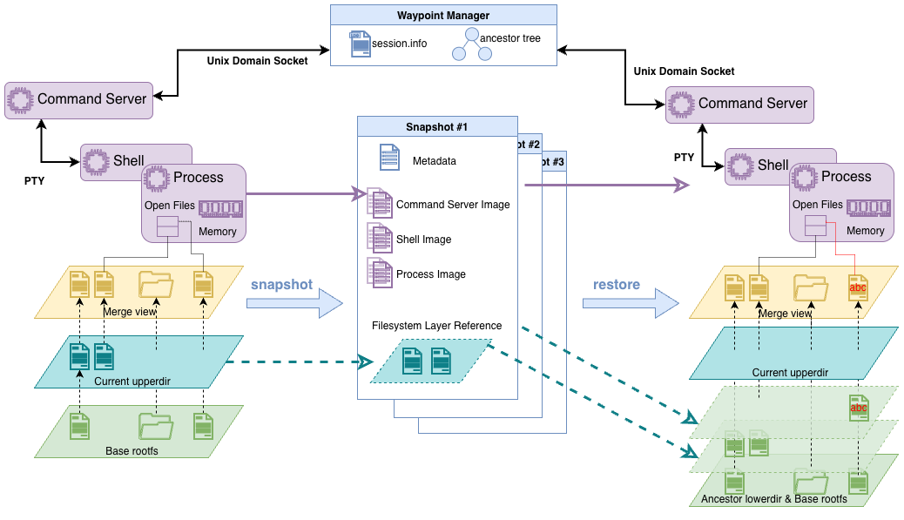

#  Waypoint

A lightweight checkpoint/restore tool that captures both filesystem and memory state with minimal overhead. 
Built on top of CRIU and OverlayFS for fast, isolated process state management.

> **Naming note:** Waypoint was previously called **Checkpoint-lite**. Some older blog posts, videos, and public announcements may still use the Checkpoint-lite name; they refer to the same project lineage.

## Overview 🌟

`waypoint` provides a simple interface to checkpoint and restore running processes while capturing all their 
memory state, live terminal sessions, and filesystem changes. Unlike heavyweight container solutions, this tool focuses
on minimal overhead by directly orchestrating existing kernel features and redesigning terminal session management.

### Key Features

- **Hybrid State Capture**: Combines filesystem (OverlayFS) and memory (CRIU) checkpointing
- **Parallel Forking**: Non-destructively materialize many live, independently mutable forks from one immutable checkpoint
- **Terminal Session Support**: Preserves live terminal sessions and their state across checkpoints
- **Multi-Session Support**: Concurrent usage by multiple applications with isolated sessions
- **Minimal Overhead**: Direct system calls without unnecessary container abstractions
- **Minimal File IO**: Uses multiple lower-layer designs to achieve true inter-checkpoint deduplication
- **Simple CLI**: Straightforward command-line interface for checkpoint operations
- **Session Management**: Automatic cleanup and resource management

## Architecture 🧱

### Design Philosophy

After analysis of existing checkpoint/restore solutions using our analysis tool [StateFork](https://github.com/Alex-XJK/StateFork)
and [StraceTools](https://github.com/Alex-XJK/stracetools), we identified that many traditional solutions often bundle 
unnecessary features like network isolation, security policies, and registry operations. 
`waypoint` takes a minimalist approach:

1. **Filesystem State**: Uses OverlayFS to capture directory changes without copying entire filesystems
2. **Memory State**: Leverages CRIU for process memory and execution state
3. **Terminal Sessions**: Implements a custom RPC-style PTY session management to preserve live terminal sessions across checkpoints
4. **Isolation**: Session-based isolation instead of full containerization
5. **Performance**: Direct tool orchestration minimizes call overhead

### Core Components

```
┌─────────────────┐    ┌─────────────────┐           ┌─────────────────┐
│   Filesystem    │    │     Memory      │ ───────── │   PTY Session   │
│   (OverlayFS)   │    │     (CRIU)      │           │   Management    │
└─────────────────┘    └─────────────────┘           └─────────────────┘
         │                       │
         └───────────┬───────────┘
                     │
            ┌─────────────────┐
            │   waypoint      │
            │   Session Mgr   │
            └─────────────────┘
```

- **OverlayFS Integration**: Creates layered filesystem views with minimal storage overhead
- **CRIU Orchestration**: Manages process memory dumping and restoration
- **PTY Session Management**: Uses an RPC-style approach to capture and communicate with terminal sessions
- **Session Manager**: Handles concurrent usage and resource isolation

### Go Language Technology Decision
The tool is implemented in Go for its simplicity, performance, and strong concurrency support.
See [our architecture decision record](./docs/tech_selection_note.md) for more details on why Go was chosen.

## Installation 🔧

Waypoint can be installed either through the project setup targets or manually.
For full details, see [Installing Waypoint](./docs/INSTALL.md).

### Scripted Setup (Recommended)

This path uses the repository `Makefile` to install system packages, build the
binaries, install the CLI/helper pair, and run a root-level host check.

```bash
git clone https://github.com/Alex-XJK/waypoint.git
cd waypoint

# Ubuntu/Debian helper for host packages, CRIU, and Go. This mutates system state.
sudo make deps-ubuntu

make build
make test
sudo make install
sudo make check

waypoint version
```

If you do not want to use `make`, the `./setup` script provides equivalent
commands, such as `./setup build`, `sudo ./setup install`, and
`sudo ./setup check`.

### Manual Installation

#### Prerequisites

- Linux system with root privileges
- CRIU installed and configured, including the `criu` and `crit` commands
- OverlayFS support (most modern Linux distributions)
- Go 1.25 or the version listed in `go.mod` (for building from source)
- Host utilities used by Waypoint: `mount`, `umount`, `cp`, `findmnt`, `lsof`, `fuser`, `ps`, and `bash`
- Optional: `buildah` for the build from Dockerfile approach (since v0.5.0)

#### Install Go (just for reference)

```bash
# Install Go (version 1.25.0)
wget https://go.dev/dl/go1.25.0.linux-amd64.tar.gz
sudo rm -rf /usr/local/go && sudo tar -C /usr/local -xzf go1.25.0.linux-amd64.tar.gz

# Add to ~/.bashrc or ~/.profile
export PATH=$PATH:/usr/local/go/bin
export GOPATH=$HOME/go
export GOBIN=$GOPATH/bin

# Reload shell
source ~/.bashrc

# Verify installation
go version
```

#### Install CRIU

```bash
# Ubuntu/Debian
sudo apt-get install criu
# or go to https://launchpad.net/~criu/+archive/ubuntu/ppa

# Verify installation
sudo criu check
```

#### Build from Source

```bash
git clone https://github.com/Alex-XJK/waypoint.git
cd waypoint
go build -o waypoint ./cmd/waypoint
go build -o bash_init ./cmd/bash-init
```

#### Check Waypoint Version

```bash
./waypoint version
# Output: waypoint version v0.7.0
```

You can also run the root-level host check from the setup script after manual
installation:

```bash
sudo ./setup check
```

## Usage 🗂

### 0. [Optional] Configure Global Settings

You can create a configuration file to set global options. Example content:
```json
{
  "sessions_dir": "/custom/path/waypoint-sessions",
  "bash_init_src": "/custom/compiled/bash_init",
  "preserve_session_on_cleanup": false
}
```

Configuration takes effect in the following order of precedence:
1. The direct environment variable `WAYPOINT_SESSIONS_DIR`, `WAYPOINT_BASH_INIT_SRC`, `WAYPOINT_PRESERVE_SESSION_ON_CLEANUP`, etc. (if set)
2. Load from configuration file (if exists):
   - Explicit `WAYPOINT_CONFIG` environment variable
   - Binary-side config: `./config.json` (same dir as executable)
   - User config: `$XDG_CONFIG_HOME/waypoint/config.json` or `~/.waypoint/config.json`
   - System config: `/etc/waypoint/config.json`
3. Default settings.

### 1. Initialize Environment

#### 1.1. Initialize with Workspace

Create a managed environment for your application:

```bash
sudo ./waypoint init /path/to/your/workspace
```

Output:
```
Environment initialized!
Session ID: a1b2c3d4e5f6g7h8
Work in this directory: /tmp/waypoint-sessions/a1b2c3d4e5f6g7h8/work

Save the session ID for future operations!
```

**Important**: Save the session ID and work in the provided directory.

Special options:
- `--quiet` to output only the session ID and work directory, separated by a comma. (Since v0.2.1)
- `--shell` to start a shell in the managed environment immediately after initialization. (Since v0.5.0)
  - You should make sure the provided workspace contains the necessary files for the shell to work, e.g., `/bin/bash`.

#### 1.2. Build Environment with Dockerfile (since v0.5.0)

You can alternatively build a sandbox environment directly with the `build` command, just like a Docker build.
This will set up a sandboxed environment with the provided Dockerfile and start a bash session in it.

```bash
sudo ./waypoint build /path/to/your/Dockerfile-directory
```

Output:
```
(Some build output from buildah...)
Sandbox environment built successfully!
Session ID: a1b2c3d4e5f6g7h8
Work in this directory: /tmp/waypoint-sessions/a1b2c3d4e5f6g7h8/work
Sandbox bash PID: 1234

Save the session ID for future operations!
```

Special options:
- `--quiet` to output only the session ID, work directory, and bash PID, separated by commas.

> Credit: This `buildah`-based workflow was originally designed by [Tianle Zhou](https://www.linkedin.com/in/tian-le-zhou-99a145221/)
in his TBench integration for v0.2.0.

### 2. Run Your Application

#### 2.1. Manual Execution (not recommended)

The simplest way is to just run your application in the provided work directory.

```bash
cd /tmp/waypoint-sessions/a1b2c3d4e5f6g7h8/work
./your-application &
# Note the PID, e.g., 1234
```

#### 2.2. Execute Shell Commands in a Fork

Initializing with `--shell` (or using `build`) gives you a live, isolated shell
called the `main` fork. You run commands in a fork with `exec`, and the fork
keeps its shell state (cwd, environment variables, background jobs) across calls:

```bash
sudo ./waypoint exec a1b2c3d4e5f6g7h8 main -- cat hello_world.txt
sudo ./waypoint exec a1b2c3d4e5f6g7h8 main -- 'cd /app; export ENV_VAR=start'
```

Everything after `--` is a single bash command line. `exec` exits with the
command's own exit code, so it composes like `ssh`/`docker exec`. Commands on
the same fork serialize; commands on different forks run concurrently.

### 3. Checkpoint a Fork

A checkpoint is an immutable snapshot of a fork's filesystem and memory. Use
`checkpoint` to snapshot the `main` fork into a named checkpoint:

```bash
sudo ./waypoint checkpoint a1b2c3d4e5f6g7h8 checkpoint-name
```

### 4. Fork and Snapshot

`fork` materializes a live, writable instance from any checkpoint. Fork the same
checkpoint several times to explore divergent branches in parallel — each fork
gets its own private copy-on-write filesystem and its own process tree:

```bash
sudo ./waypoint fork a1b2c3d4e5f6g7h8 checkpoint-name --id f1
sudo ./waypoint fork a1b2c3d4e5f6g7h8 checkpoint-name --id f2
```

`snapshot` seals a live fork's current state into a new checkpoint (which can
itself be forked again — recursive checkpointing is ordinary), and `destroy`
tears a fork down:

```bash
sudo ./waypoint snapshot a1b2c3d4e5f6g7h8 f2 checkpoint-name-2
sudo ./waypoint destroy a1b2c3d4e5f6g7h8 f1
```

### 5. List Available Sessions, Checkpoints, and Forks

```bash
sudo ./waypoint list
sudo ./waypoint list a1b2c3d4e5f6g7h8
sudo ./waypoint list a1b2c3d4e5f6g7h8 --json
```

Without a session ID, `list` shows all recorded session IDs. With a session ID,
it shows that session's checkpoints and its live forks; add `--json` for the
stable machine-readable shape.

### 6. Inspect System, Session, and Checkpoint Info

```bash
sudo ./waypoint info
sudo ./waypoint info a1b2c3d4e5f6g7h8
sudo ./waypoint info a1b2c3d4e5f6g7h8 checkpoint-name
```

The `info` command prints JSON for system/configuration details, a specific session, or a specific checkpoint.

### 7. Clean Up Session

```bash
sudo ./waypoint cleanup a1b2c3d4e5f6g7h8
```
If this basic version of the cleanup command fails, **waypoint** will automatically suggest further actions. You can use:
- `--force` to forcefully remove and unmount all related resources.

For debugging, set `preserve_session_on_cleanup` to `true` in the config file, or set `WAYPOINT_PRESERVE_SESSION_ON_CLEANUP=true`. Cleanup will still stop processes and unmount resources, but it will keep the session directory and session registry entry for inspection.

## Demo 🎥

- **Direct CLI Usage** – Using waypoint directly from the terminal: https://youtu.be/bdo0th40yrE

## Example Workflow 🧩

### Parallel Forking with a Shell Session
```bash
# Initialize environment using a Dockerfile
sudo ./waypoint build /home/docker-tasks/context
## STEP 1/3: FROM ubuntu-24-04:latest
## (Some build output from buildah...)
## Sandbox environment built successfully!
## Session ID: abc123def456
## Work in this directory: /mydata/waypoint-sessions/abc123def456/work
## Sandbox bash PID: 123456
##
## Save the session ID for future operations!

# Build up some hidden shell state in the main fork
sudo ./waypoint exec abc123def456 main -- 'cd /app; export ENV_VAR=start'

# Checkpoint the main fork into an immutable checkpoint
sudo ./waypoint checkpoint abc123def456 before-run
## Checkpoint 'before-run' created successfully

# Fork the checkpoint twice to explore two branches in parallel
sudo ./waypoint fork abc123def456 before-run --id runA
sudo ./waypoint fork abc123def456 before-run --id runB

# Each fork inherits the state, then diverges independently
sudo ./waypoint exec abc123def456 runA -- './run-app.sh --mode fast; export ENV_VAR=finished-A'
sudo ./waypoint exec abc123def456 runB -- './run-app.sh --mode slow; export ENV_VAR=finished-B'

sudo ./waypoint exec abc123def456 runA -- 'echo VALUE: $ENV_VAR PWD: $(pwd)'
## VALUE: finished-A PWD: /app
sudo ./waypoint exec abc123def456 runB -- 'echo VALUE: $ENV_VAR PWD: $(pwd)'
## VALUE: finished-B PWD: /app

# Recursively snapshot runA's diverged state into a new checkpoint
sudo ./waypoint snapshot abc123def456 runA after-run-A
## Fork 'runA' snapshotted as checkpoint 'after-run-A'

# Inspect the checkpoint/fork DAG
sudo ./waypoint list abc123def456

# Clean up when done (kills forks, unmounts overlays, removes the session)
sudo ./waypoint cleanup abc123def456
```

## Directory Structure 🗃

```
/custom/path/waypoint-sessions/    # Configured sessions directory
    └── abc123def456/               # A session
        ├── checkpoints/            # Immutable checkpoint DAG nodes
        │   └── before-run/
        │       ├── upper/          # Sealed, immutable filesystem delta
        │       └── criu/           # CRIU memory image (+ dump.log)
        │           └── *.img
        ├── forks/                  # Live, mutable fork instances
        │   ├── main/               # The main fork (from init --shell)
        │   │   ├── fork.json       # Live fork record
        │   │   ├── upper/  work/   # This fork's private CoW layers
        │   │   └── restore.log
        │   ├── runA/
        │   └── runB/
        ├── metadata/               # Checkpoint metadata
        │   └── before-run.json     # "Metadata" for the before-run checkpoint
        ├── locks/                  # Session/fork flocks
        ├── temp/                   # Shell socket + logs
        └── work/                   # Canonical merged mountpoint (per-fork)

/tmp/waypoint-sessions-info/       # Global session registry
    └── abc123def456.json           # "SessionInfo" for the session above
```

## Technical Details ⌨️



### OverlayFS Initialization
- **Lower Layers**: The original workspace plus every parent checkpoint's sealed upper layer (read-only)
- **Upper Layer**: This fork's private changes (copy-on-write)
- **Work Layer** (`forks/<fork>/work/`): Temporary storage for OverlayFS internal operations
- **Merged View** (`work/`): Combines the fork's upper with the lower layers for the process to see

### Snapshot (fork → checkpoint)
- **CRIU Dump**: Dumps the fork's process memory, file descriptors, and execution state
- **Seal Upper**: Moves the fork's upper layer into the checkpoint as an immutable, shareable delta
- **Rebase**: Gives the fork fresh upper/work layers stacked on the new checkpoint and resumes it
- **Metadata Management**: Records the checkpoint's `ParentID` and resolved `LayerIDs` chain

### Fork (checkpoint → live fork)
- **Non-destructive**: The source checkpoint is immutable, so one checkpoint can be forked many times
- **Private Overlay**: Each fork mounts its own overlay (checkpoint layers + a private upper) in its own mount namespace
- **CRIU Restore**: Rebuilds the fork's process tree from the checkpoint's memory image, detached and concurrent

### Session Isolation
Each session gets:
- Unique randomly generated session ID
- Isolated directory structure
- Independent OverlayFS mounts
- Separate checkpoint namespaces
- Dedicated Shell server for terminal session management

### Terminal Session Management
- **RPC server**: A controlling process that manages a PTY session and listens for commands via Unix domain socket
- **Isolated bash core**: A long-running bash session in a `chroot`-isolated environment that executes commands
- **RPC-style communication**: The bash server receives commands, forwards them to the bash core, and returns results, allowing stateful command execution across checkpoints
- **RPC client**: The main waypoint process acts as a client to send commands to the bash server

> Credit: This is an iterated version of the command injection method implemented by 
[Georgios Liargkovas](https://liargkovas.com/) in the v0.4.0 series. It was first designed and trialed by 
[Alex Jiakai Xu](https://alex-xjk.github.io/) in his [pty-rpc-shell](https://github.com/Alex-XJK/pty-rpc-shell) side project.

## Limitations

- Requires root privileges (CRIU and OverlayFS requirement)
- Linux-specific (depends on CRIU and OverlayFS)
- Network connections may not survive checkpoint/restore

## Citation

If you use waypoint in academic research, please cite:
```bibtex
@misc{xu2025systemsfoundationsagenticexploration,
      title={Toward Systems Foundations for Agentic Exploration}, 
      author={Jiakai Xu and Tianle Zhou and Eugene Wu and Kostis Kaffes},
      year={2025},
      eprint={2510.05556},
      archivePrefix={arXiv},
      primaryClass={cs.DC},
      url={https://arxiv.org/abs/2510.05556}
}
```
